Analysis Modules
================

Goals
-----
* Review the Analysis Modules and How they work
* We will be covering calibration and customization only lightly

Analysis Modules Overview
-------------------------

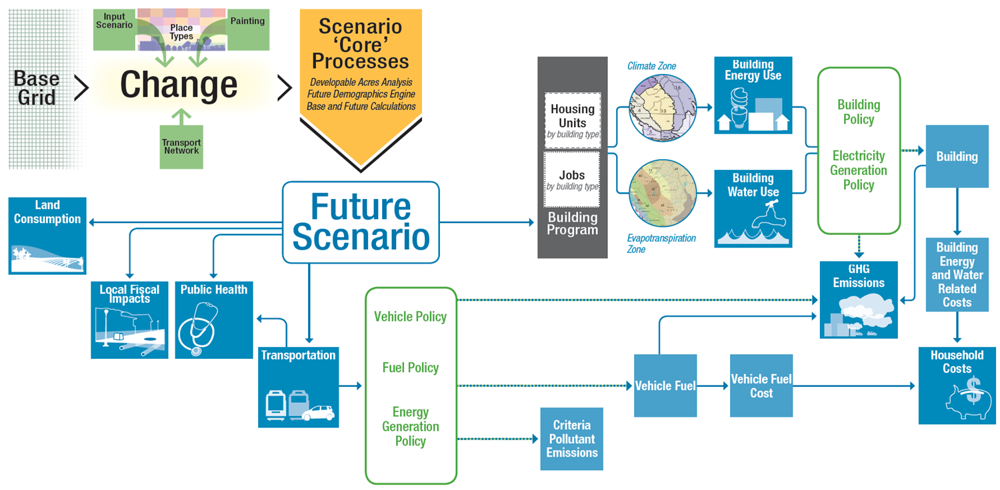

Analysis modules are generally run following the completion of a scenario, or at "break points" within the development of a scenario to evaluate how the scenario is performing. Some of these analytical modules take a few minutes to run and as such aren't something that is run following every change to the scenario.

As shown in the image above, many of the analytical modules are connected to each other. For example, several of the analytical modules use outputs generated by running the transportation analytical module. 

Land Consumption
----------------

UrbanFootprint identifies the amount of greenfield and refill land consumed in the scenario.

*Figure LC 1: The Land Consumption Measurement Process*

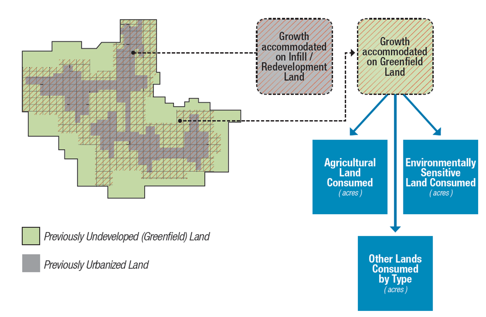

It does this by using a data set to divide the entire landscape into greenfield and developed space, this has been done in the past using the FMMP.

Each polygon then has a percentage of it's land area that is developable greenfield space and developable "refill" space. The polygon is then analyzed so that if it has more developable greenfield space than refill any development in the polygon is considered greenfield consumption and if there is more developable refill space than greenfield any development is considered refill. The total acrage of greenfield and refill development is then calculated across the entire scenario.

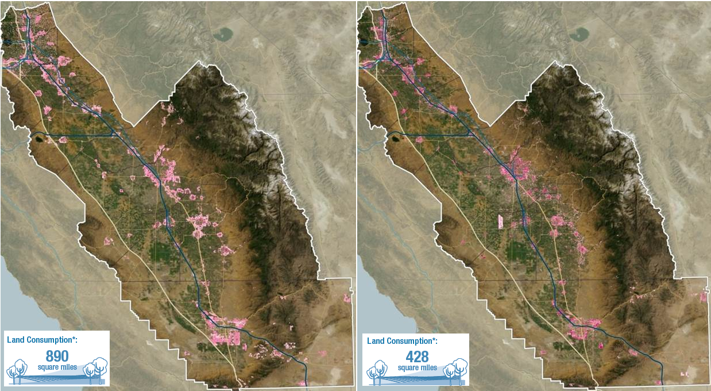

A comparison of the 2050 projections in Scenarios A and B+ from the San Joaquin Valley Blueprint (2009)

Building Energy Use
-------------------

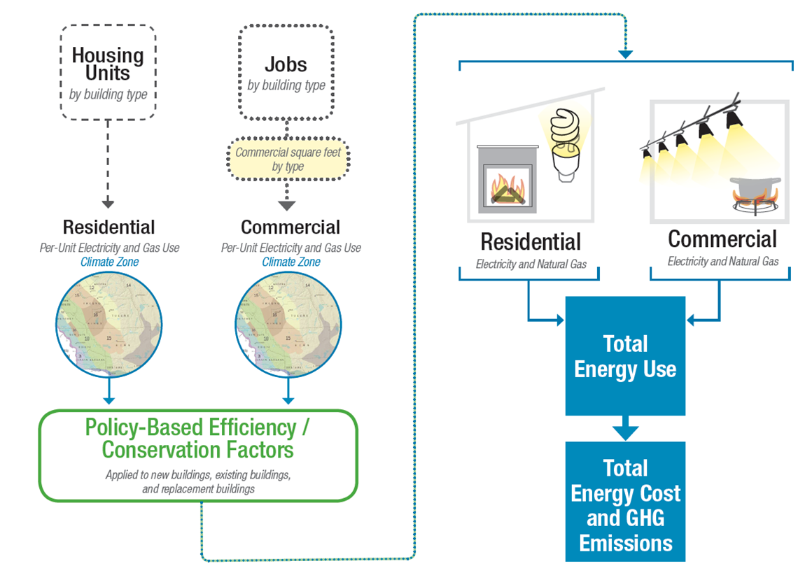

Each building type in UrbanFootprint consumes a baseline amount of energy based on its location and designated policy factors.  Residential energy use is computed based on each dwelling unit, by type, and commercial by their square footage by usage (i.e. retail, office, industrial…).

The location determines which climate zone the building is in, and that determines the baseline energy consumption. The California Energy Commission's Title 24 Building Standard climate zones are used for residential energy factors and the Forecasting Climate Zones are used for commercial energy use.

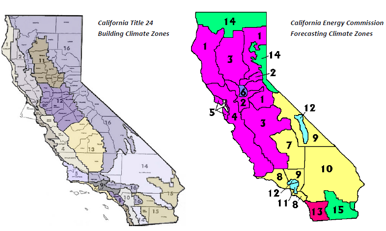

Baseline residential energy use factors are developed from the CEC's Residential Appliance Saturation Survey (RASS), in this case the 2009 dataset was used. 

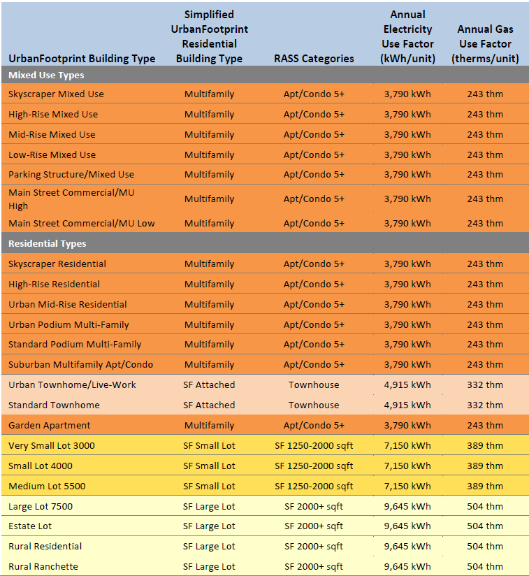

Energy use in common areas of mixed use and multifamily structures is estimated based on the CEC's Commercial End-Use Survey (CEUS) data for lodgings.

The baseline energy use for commercial structures is developed from the CEUS data sets as Energy Intensity (EI), the energy used per square foot, for 14 building types, classified by CEC Forecasting Climate Zone.

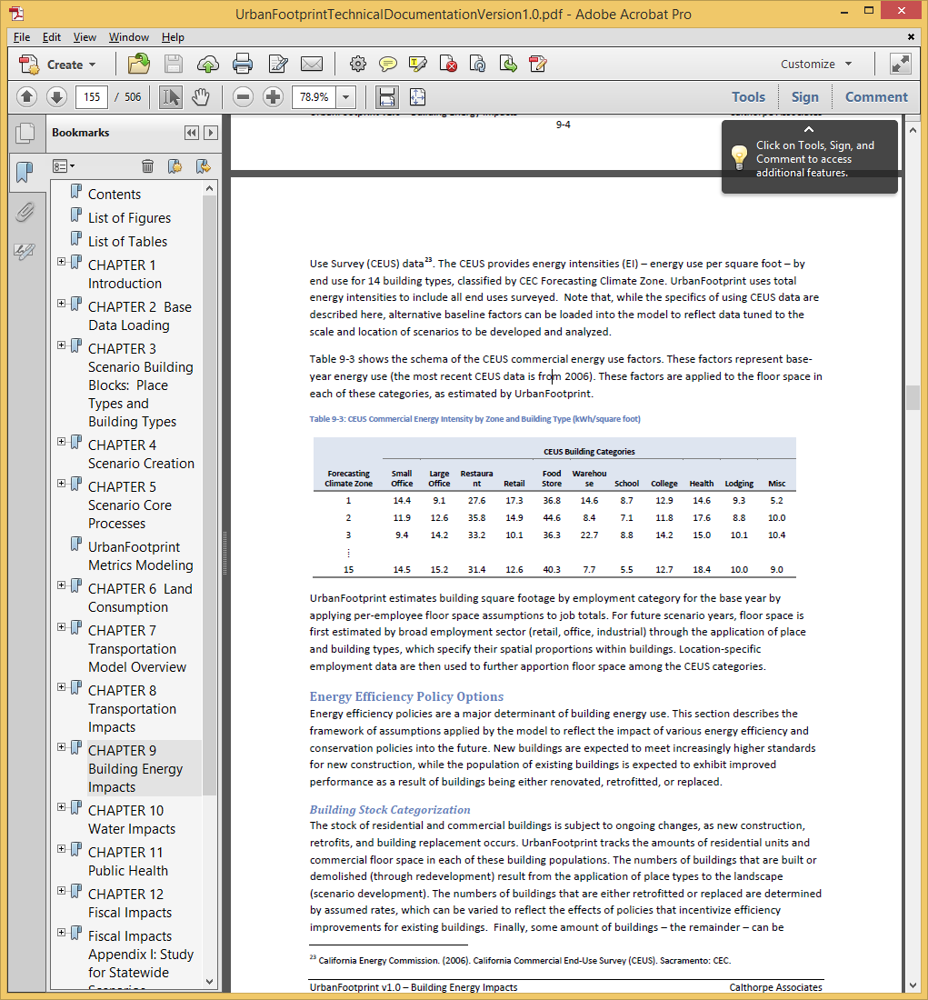

Baseline energy consumption is assumed to be fixed with the exception of an incremental improvement in efficiency over time.  Buildings present in at the base line year, can have a rate of retrofitting or replacement (with the same building type) which improve those building’s energy efficiency.

New buildings constructed through the scenario have policy driven baseline improvements in energy efficiency and then are also subject to rates of retrofitting and replacement. 

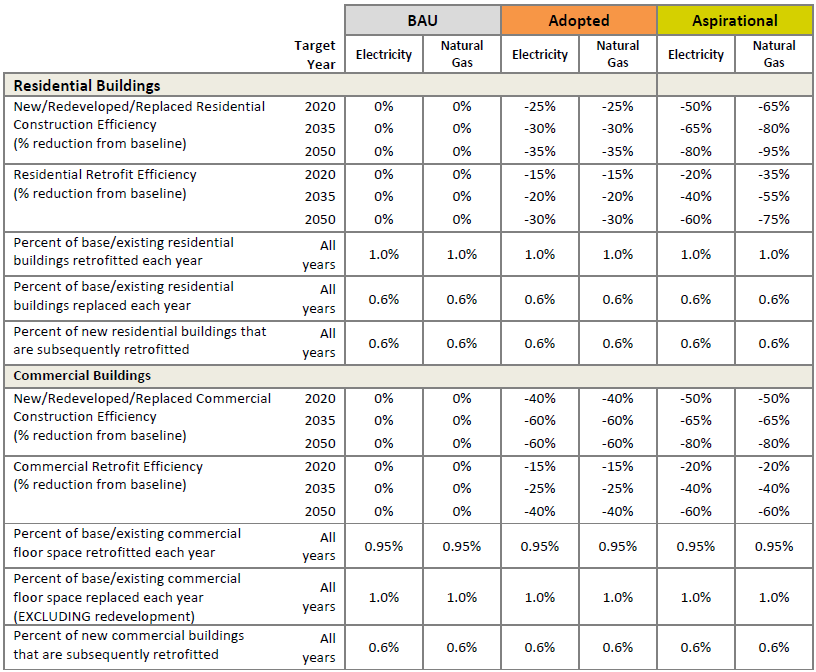

Energy policy options are implemented through applying rates of improvement in baseline efficiency to buildings that are either new construction or are retrofitted, with new construction (or major retrofits) being a full update to the projected energy efficiency at the time of construction and retrofits being a significant improvement over the baseline efficiency that the building had prior to retrofit.

.. image:: graphics/UF_TD_9.4.png

After generating total energy used, assumed costs for electricity and natural gas can be applied allowing the calculation of energy costs. Similarly, based on the energy consumed and the potential sources of that energy GHG emissions may be calculated. 

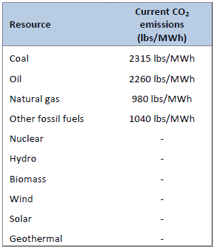

The calculations that determine the number and age of units or commercial use follow two paths:

* Existing units experience retrofits and upgrades based on the start year energy efficiency. Replacements of these units move to the new unit queue reducing the number of units being tracked as part of the existing stock.
* New units are tracked and have the potential for both replacement and retrofit as time passes. 

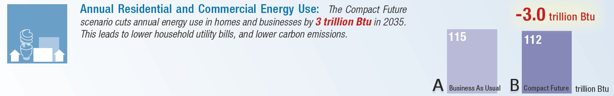

Water Use
---------

* Water impacts follow a very similar path to Energy.
* Building type and climate zone determine baseline water used both indoor and outdoor
* Indoor water usage is estimated per-capita by building type
  
  * Residential

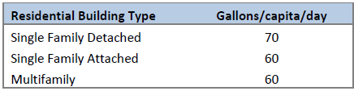

  * Commercial is estimated based on three employment types, commercial, institutional, and industrial.

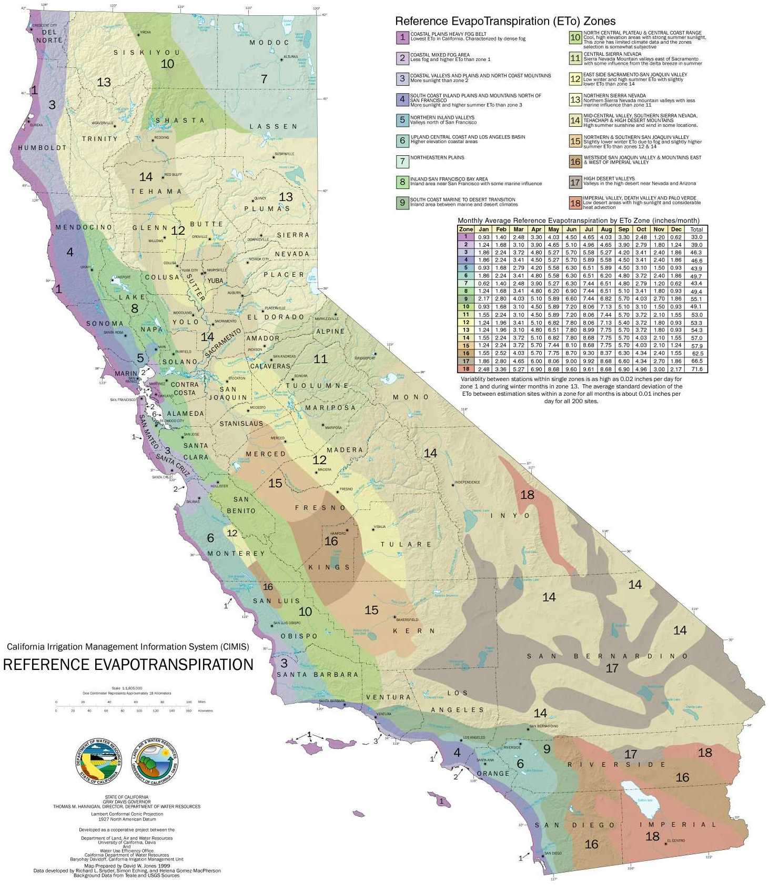

* Outdoor water usage is estimated per square foot of irrigated outdoor space adjusted by the climate zone.
 
  * Within 18 climate zones the California DWR provides monthly and yearly ETo (reference evapotranspiration values). These are a measure of the amount of water needed to support landscaping. Based on these, we can estimate the water required per acre of landscape.
  
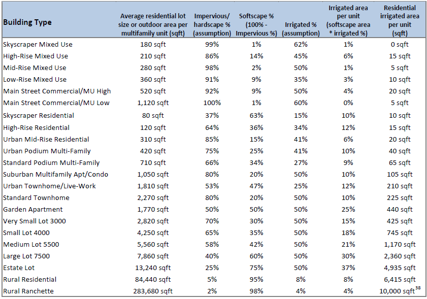

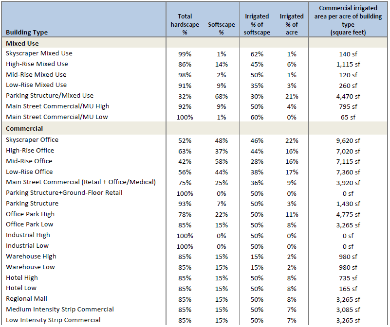

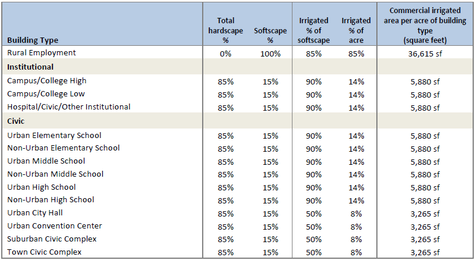

* Consumption rates are then adjusted to account for efficiency and conservation improvements in future years.

  * Like Energy, water consumption by buildings assumes rates of efficiency improvements as well as retrofitting or building replacements or major renovations.

  .. image:: graphics/UF_TD_10.4.png

The calculations that determine the number and age of units or commercial use follow two paths:

* Existing units experience retrofits and upgrades based on the start year energy efficiency. Replacements of these units move to the new unit queue reducing the number of units being tracked as part of the existing stock.
* New units are tracked and have the potential for both replacement and retrofit as time passes.

Local Fiscal Impacts
--------------------

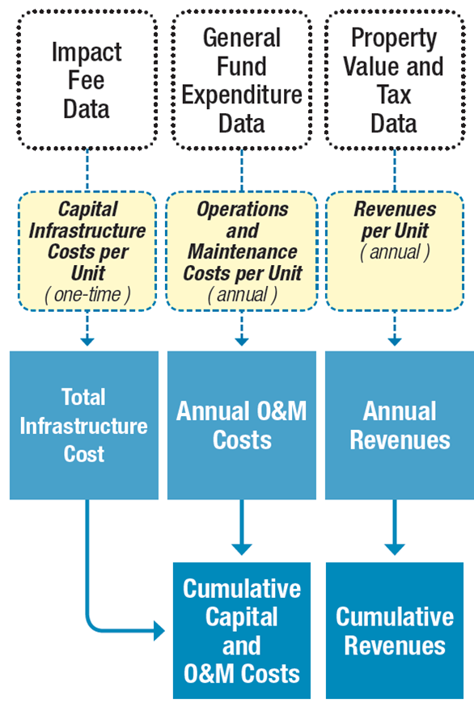

Fiscal impact analysis divides the build landscape across three axes. Urban, compact, or standard developments (Land Development Class or LDC), refill or greenfield construction (development condition), and housing type (single family detached large lot, single family detached small lot, single family attached, and multi-family. This version of the fiscal analysis module applies only to residential development.

.. image:: graphics/AM_LocalFiscal2.png
	:align: right
	:width: 200 px

Urban is high density development characterized by city centers
Compact is a highly walkable, mixed use urban form
Standard includes most suburban, auto-oriented construction.
 
Infrastructure costs are calculated per residential unit by type, LDC, and greenfield or refill type. Infrastructure costs are assumed to be a one time cost. And include the installation of transportation, water, and waste water facilities.

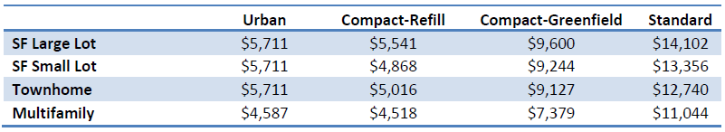

Operations & Maintenance costs are long term infrastructure related costs assessed over time on a per residential unit basis by building type and LDC. 

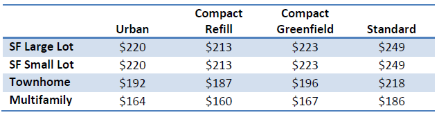

Local Revenues include the projected property tax, property transfer, and vehicle license fees based on the building type and LDC. i.e. Urban areas have lower vehicle ownership and the estimates reflect that in the vehicle license fees. 

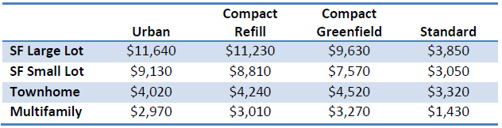

Transportation
--------------

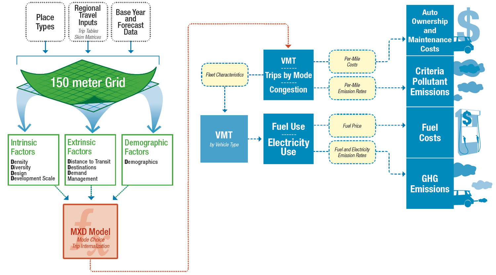

Transportation is the most complex of the analytical modules and may require a half hour or more to run. 

Put simply, UrbanFootprint builds a picture of the land use and accessibility surrounding each housing unit and applies an enhanced version of the MXD model developed by Fehr & Peers with EPA funding (http://www.epa.gov/smartgrowth/mxd_tripgeneration.html) to appropriately scale per capita VMT estimates drawn from a local transportation model up or down as the land use mixture changes. 

These results are then fed into a secondary model that applies projections of future vehicle fleet mixtures and efficiencies to obtain estimates of the quantity and types of energy used to power the fleet, the number and length of trips made, the pollutants emitted, and the costs both for fuel and vehicle O & M.

The results from the Transportation module have matched very well with MPO travel models. It is important to note that this requires careful calibration to achieve.

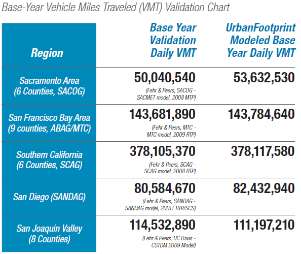

The results from the Transport Module can be displayed visually and in tabular forms. For example these results are from the Vision California project by Calthorpe Associates (now Calthorpe Analytics) and display VMT per household for the Sacramento Area Council of Governments' 2035 land use projections with accompanying info graphic showing a comparison of two scenarios.

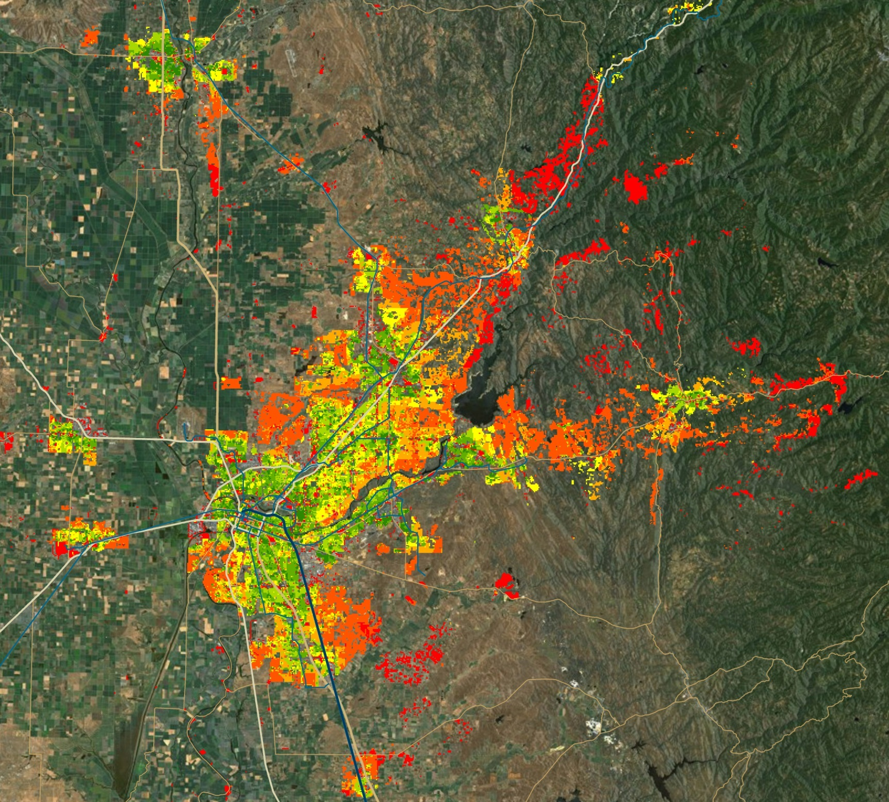

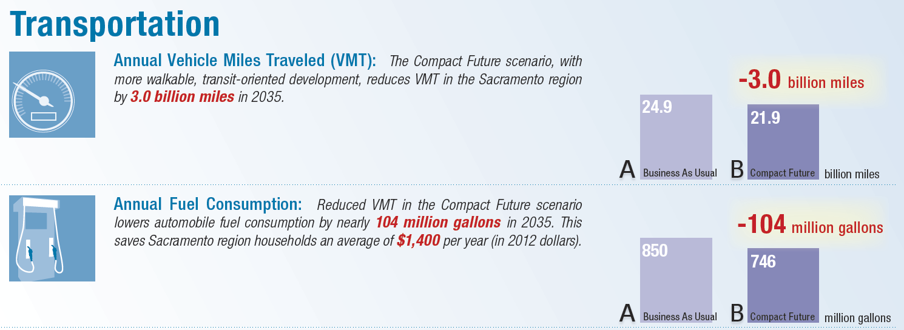

UrbanFootprint incorporates a comprehensive ”sketch”
travel model that interacts with regional travel network
data to produce vehicle miles traveled (VMT), mode
choice, and congestion estimates for land use +
transportation scenarios, as well as transportation-
related costs, greenhouse gas (GHG) emissions, and
pollutant emissions. The core of UrbanFootprint’s
travel engine was adapted from the MXD model
(described below) created by Fehr & Peers, an
internationally-known firm specializing in state of the
art travel behavior research and prediction.

The MXD method allows differentiation among a broad
array of land use Place Types, the building blocks of
UrbanFootprint, calculating the vehicle trip reductions
resulting from the specific combination of D variables
that characterize each Place Type. MXD transportation-
demand relationships allow the combination of
intrinsic D variables for a specific Place Type, coupled
with the extrinsic factors that describe the place’s
location within the region, to dictate the degree to
which the place generates more or less vehicle travel
than the regional average.

Costs and emissions estimates for each scenario are
based on policy inputs, which allow the user to see the
quantification of the effects of variations in factors
including: fuel price; the carbon content of fuels;
vehicle fuel economy; vehicle fleet turnover; and the
relationship between a widespread shift to vehicle
electrification and the carbon intensity of the
electricity generation portfolio. UrbanFootprint thus
Figure 7-1: Overview of the UrbanFootprint travel engine
allows users to quickly and easily see the
transportation-related impacts of the changes in
transportation systems, urban form and regional development patterns between various land use and
transportation scenarios.

Travel Forecasting in UrbanFootprint
____________________________________

The travel forecasting capabilities within UrbanFootprint are based on a comprehensive body of
research on the relationships between travel generation and the characteristics of the built
environment. The supporting research includes:

* Travel and the Built Environment; Ewing and Cervero; 2010
* Traffic Generated by Mixed-Use Developments—Six-Region Study; Ewing and Walters, et al; 2011. (Included as Appendix B of this report.)
* 2010 California Regional Transportation Plan Guidelines, California Transportation Commission
* Assessment of Local Models and Tools for Analyzing Smart-Growth Strategies; Caltrans , DKS; 2007
* Growing Cooler – The Evidence on Urban Development and Climate Change; Ewing and Walters et.al.; 2008
* Guidelines for Quantifying the GHG Effects of Transportation Mitigation, California Air Pollution Control Officers Association, 2010

This and other research have found that urban form, transportation supply and management policies
affect vehicle miles traveled (VMT), automobile and transit travel through at least eight mechanisms,
referred to as the “8Ds”.

Measurement of the ‘8Ds’ in UrbanFootprint
__________________________________________

The UrbanFootprint travel engine uses the findings from California and nationwide MXD research to
quantify the transportation effects of differences in transportation and development form ranging from
highly-sustainable compact, mixed and transit-oriented forms to land use patterns that are more auto-
dependent. This relies upon measurement of each of the following ‘8Ds’ for each micro-scale
development area (each 5.5-acre land use grid cell).

1. *Density* – Dwellings and jobs per acre of development.
2. *Diversity* – Mix of housing, jobs and retail, measured in terms of ratios such as jobs/housing, retail/housing and jobs mix (closeness to a balance among uses).
3. *Design* – Connectivity and walkability, measured in terms of how fine-grained the circulation networks through metrics of network density, such as walkable street intersections per square mile
4. *Destinations* – Regional accessibility to activities from the regional travel model networks “skim matrices” of travel distances and travel times among all development areas or travel analysis zones (TAZs).
5. *Distance to Transit* – Proximity to fixed-guideway service measured from the UrbanFootprint development grid cell to the nearest transit stops, and expressed in terms of transit stops within walking radii of 1⁄4 and 1⁄2 mile.
6. *Development Scale* – Absolute local amounts of population and jobs within the development grid cell’s neighborhood (critical mass and magnitude of compatible uses), measured in terms of a 1⁄2 mile walking radius
7. *Demographics* – Household size, income and auto ownership of the residential development types contained in the grid cell.
8. *Demand Management* – Automobile travel disincentives, including regional pricing of auto travel through fuel costs, mileage-based fees and taxes and parking charges (Method has been developed, but is not implemented in UrbanFootprint version 1.0).

UrbanFootprint quantifies the relationships to the first seven “Ds” through a series of equations from
the most recent and rigorous statistical study: Traffic Generated by Mixed-Use Developments—Six-
Region Study Using Consistent Built Environmental Measures, prepared for the US EPA and reviewed by
the American Society of Civil Engineers. The study developed hierarchical models that capture the
relationships between the “D” factors and the amount of travel generated by over 230 mixed-use
developments of a wide variety of settings and sizes across the US, including the Sacramento and San
Diego regions. The predictive accuracy of the methods were validated through field surveys of traffic at
almost 30 other development sites, more than half of which are located in California, at locations in San
Diego, Orange County , Sacramento and the San Francisco Bay Area.

The resulting method, known as the MXD method, uses a series of equations to estimate the likely
degree to which a development area’s external traffic generation will be reduced due to development
density, diversity, design, destination accessibility, distance to transit, demographics and development
scale. UrbanFootprint uses the MXD method and other California research on the effects of various
Demand Management strategies as its ‘8D’ travel engine.

UrbanFootprint combines the MXD estimates of trip generation by travel mode with regional
information on transportation networks and travel distances among activities to compute measures of
accessibility and vehicle miles traveled (VMT). For consistency with regional transportation policy and
programs, UrbanFootprint draws this network information from each MPO’s regional travel models,
reflecting the region’s Sustainable Communities Strategy (SCS) and modal emphasis alternatives from its
Regional Transportation Plan (RTP).

How MXD Works
_____________

**Input factors**

*Land Use* (based on a half mile buffer around each location)

* Population, Employment
* Dwelling units by type
* Sq. ft. of Non-residential use by category: office, retail, service, public

*Urban Form* (based on a half mile buffer around each location)

* Intersection density
* Household size
* Auto ownership

*Location and Context*

* Employment within 1 mile radius
* Jobs within 30 min. by transit

**Intermediate processing**
ITE trip generation rates are applied to the land uses to calculate the maximum potential trip generation.

MXD equations are applied to calculate the likelihood of internal capture, pedestrian, or transit use. This allows the estimation of trip reductions based on the land use.

**Results**
The reduction factors from the MXD equations are applied to the maximum trip generation rates.

Household Costs
---------------

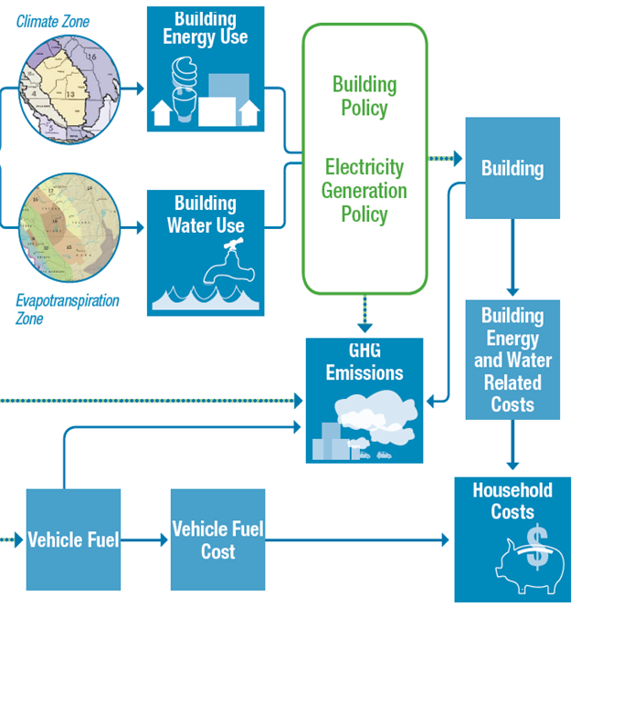

Based on the costs estimated per unit for energy and water use, as well as vehicle fuel costs, total household costs are calculated.

Public Health
-------------

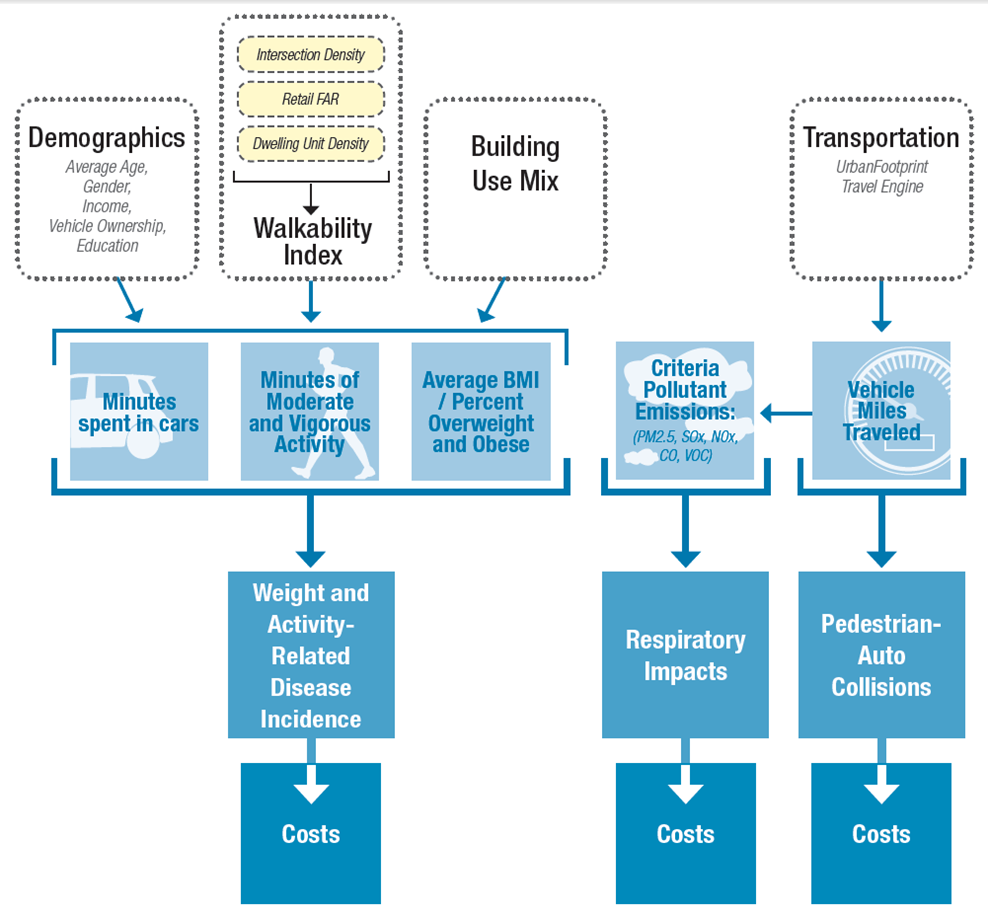

The public health module is undering a major redesign at the moment. 

The public health module builds on the transportation model as well as the baseline scenario.  Demographic assumptions combined with the local environment are used to forecast the amount of time spent in moderate and vigorous activity, proportion of the population that is overweight, and time spent in cars. These are then used to identify the incidence of weight and activity related diseases and resulting costs.

The transportation engine provides estimates of VMT and pollutants which are used to estimate pedestrian-auto collisions and respiratory illnesses, and the related costs from each.

