Scenario Editing
================

Goals
-----

#. To provide you with an understanding of how UrbanFootprint defines and manages place types and land use
#. To enable you to assist in defining a scenario’s targets.
#. To give you the technical skills to edit a scenario

 #. Through “painting” place types
 #. Using the query editor

Map Structure
-------------

UrbanFootprint builds a scenario by adding the “change” or “increment” that you’ve painted on top of a base conditions dataset. The combination of the two produces what is known as the “End state.” The “End State” represents what will be on the ground in the future (at what ever time you’re targeting). 

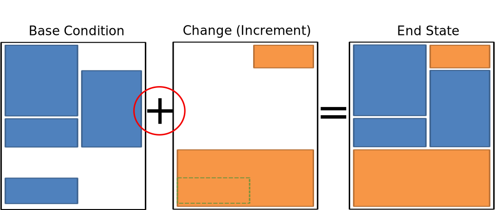

It is important to note that this isn’t just a simple addition or replacement of the base condition with the change map. UrbanFootprint implements rules that play several roles to control how overlaps are handled.

*Infill/Redevelopment:* As you add changes you are also defining for those changes whether any overlaps with the base condition should be treated as Infill where much of the existing land use is left in place, and additional development is added to fill in any available capacity. Alternately the existing condition can be cleared from the parcel to represent a full reconstruction of the location. 

*Development Constraints:* Layers can be added to the scenario that constrain development in locations that overlap. More on these later.

How Place Types Work
--------------------

Buildings
_________

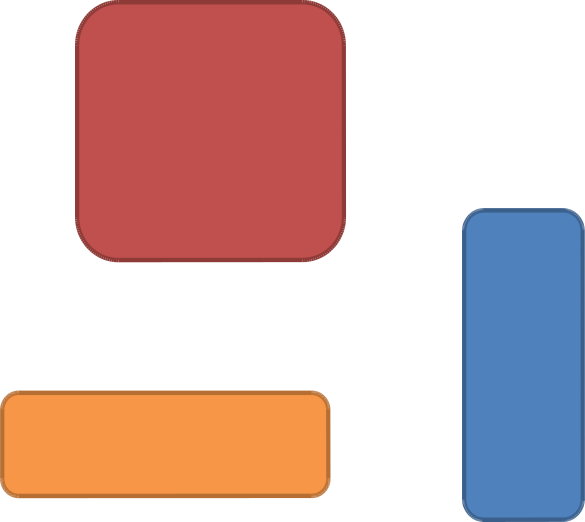

We know specific details about the buildings

* Square footage
* Stories
* Parking
* Site Layout
* Energy Use
* Water Use
* Rents
* Construction Costs

In many cases we can point to a “real” building.

Image here (building editor)

Discussion
++++++++++

#. A “Building” represents a real world building that does, or could exist in the real world. It includes a significant amount of detail about the building. 
#. All of this detail remains attached to the building as it becomes a contributor to the building type and the place type. This allows us to step backwards from a place or building type to get at these details when we need to.

Building Types
______________

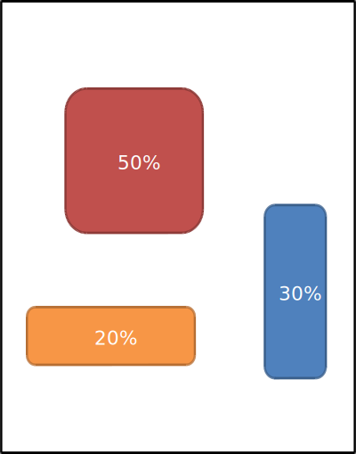

We can group similar buildings together to create a “Building Type”

Each building is assigned a percentage that it makes up of the building type.
Examples:

* Mid-rise Office
* Garden Apartment
* Single Family Dwelling
* Big Box Store

Image here (building type editor)

Discussion
++++++++++

#. Building types are groupings of buildings. 
#. Each building that contributes to a building type is assigned a percentage which represents its contribution to the building type.
#. The percentage is percentage of land area occupied by that building as a portion of the building type. i.e. if you had 100 acres of the building type, building A might represent 25 acres if it has a 25% representation.

Place Type
__________

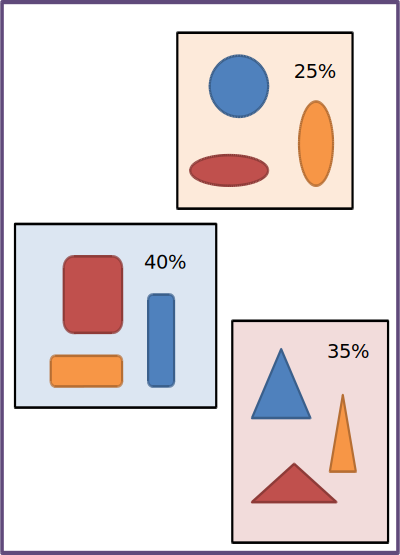

A “Place Type” is a mixture of building types.

Each building type is assigned a percentage that represents it’s proportion of the Place Type’s land area.

Through assembling Place Types in this fashion we can aggregate all of the information about the buildings up to the Place Type

Image here (building type editor)

Discussion
++++++++++

#. Similarly to the relationship between buildings and building types, building types are grouped together to create place types. 
#. Each building type has a percentage that it represents of the Place Type.
#. Having built a place type, we know information about all of the buildings in it based on the relationship from place type to building type to buildings.

RUCS Types
__________

Image here (RUCS type editor)

* A parallel structure has been developed to handle the Rural Urban Connections Strategy types
* Crop, Crop Type, and Landscape Type
* These are used for Agricultural analysis

Discussion
++++++++++

The RUCS types of Crop, Crop Type, and Landscape type are a parallel structure to the building, building type, and place type structure. It’s just intended to represent the agricultural, and in the future other openspace values for analytical purposes.

Recommended Practices
_____________________

* Prepare your building types and place types prior to beginning scenario editing. 
* There are several example type sets in use to use as a starting point
* Then avoid changing them unless it becomes clear that there is an unmet need or error within a type.

Discussion
++++++++++

Changing place types mid-process can create confusion and require that you revisit previously completed work. This could be time consuming and may lead to unintended results in your scenario.

Scenario Definition
-------------------

What are the Scenario's Goals?
______________________________

When viewed regionally, what should the scenario include?

* How much population growth?
* What changes in demographics?
* What kinds of housing will accommodate them?
* How many new jobs? And what kind of job are they?
* Where will housing and job development be prioritized?
* What areas will be protected?

Discussion
++++++++++

1. Outreach and stakeholder involvement could be highly beneficial depending on your work plan
2. Many features of the scenario should be outlined at this point:

 #. Population change
 #. Employment growth 
 #. Urban Form goals (i.e. will it involve TODs, and where, what densities, walkablity?)

3.  This is a critical step. Defining the scenarios’ goals and properties sets the rest of the planning process up.

 #. Growth centers
 #. Housing types and densities
 #. Land and resource protection goals
 #. Transportation system goals

Translating the Goals into Targets
__________________________________

Translating the Goals into Targets:

* Population
* Jobs/Housing
* Housing Types/Mixes
* Jobs Types/Mixes
* Infill
* Redevelopment

Discussion
++++++++++
Define your scenario’s goals in numeric terms.
Translate the higher level goals into numeric targets that you can meet though editing the scenario’s land use.

Existing Conditions
___________________

What are the conditions on the ground now? We will need work from a detailed map of what is the reality on the ground based on:

* A Survey of Existing Conditions
* Housing Stock
* Employment Space
* Vacant Space
* Redevelopment Potential
* Transportation Infrastructure
* Other Infrastructure

Discussion
++++++++++

The existing condition matters. You will be determining what changes to apply on top of the existing conditions and how those changes will effect the existing built form.

You will get to choose whether you are adding new development while leaving the existing structures in place, or will be redeveloping the parcels through tearing down the buildings and replacing them with all new ones.

How Will the Area Change?
_________________________

Priority Locations:
 * *For Development*

  * City or Community Centers
  * Transit Corridors

 * *For Protection*

  * Agriculture
  * Recreation
  * Public Safety
  * Open Space
  * Species
  * Ecosystem Services

Discussion
++++++++++
How will you choose where to locate the changes? 

Will you be focusing on infill? 

How much greenfield development will be permitted? 

What are the priorities for protection?

Connecting to UrbanFootprint
----------------------------

Image here (log on screen)

#. Open a web browser
#. Type in the URL or click on a provided link

 #. This may either be a domain name  

 * http://Urbanfootprint.ucdavis.edu/demosite (not an active link)

 2. Or an IP address 

 * http://127.0.0.1 (not active link)

3. Enter user name and password (for demo sites)

 * Username: test 
 * Password: test

Tour of UrbanFootprint
----------------------

A basic tour of UrbanFootprint

Overview
________

.. image:: graphics/BaseCondition.png

Scenario Switching and Charting
+++++++++++++++++++++++++++++++

.. image:: graphics/ButtonLocation_Explore.svg

Scenario Management
+++++++++++++++++++

.. image:: graphics/ButtonLocation_ScenarioManagement.svg

Layer Management
++++++++++++++++

.. image:: graphics/ButtonLocation_LayerManagement.svg

Zoom, Pan, and Select
+++++++++++++++++++++

.. image:: graphics/ButtonLocation_ZoomPanSelect.svg

Place Type Editor
+++++++++++++++++

.. image:: graphics/ButtonLocation_PlaceTypeEditor.svg

Scenario Builder
++++++++++++++++

.. image:: graphics/ButtonLocation_Editor.svg

Analysis Modules
++++++++++++++++

.. image:: graphics/ButtonLocation_Analysis.svg

Scenario Mangement
------------------

* Selecting a Geographic Area
* Selecting a scenario
* Create a scenario
* Delete a scenario
* Edit scenario details
* Review current scenario populations and employment

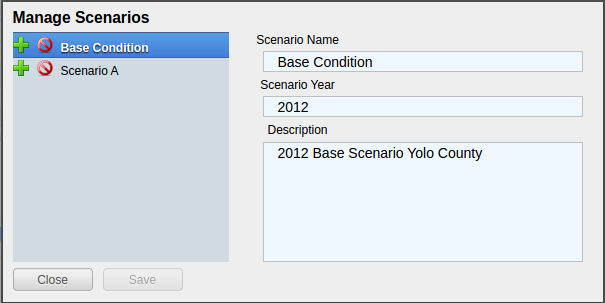

* Create a New Scenario
 
 * Click on the New Scenario button

*Note:* When starting a new area, it is a good idea to create a copy of the Scenario A that is automatically created to use as the starting point for any other new scenarios. Basically, the first thing that you do is make a copy of Scenario A to a "New Scenario Template" and any time you want to make another scenario you do so by making a copy of the template.

* Copy a Scenario

 * Click on the green icon next to a scenario name.

* Delete a Scenario
 
 * Click on the red icon next to the scenario

* Edit Scenario Details

 * Double click and edit text
 * Click Save

Charts
------

Access the charts by clicking on the "explore" button to slide the top panel open.

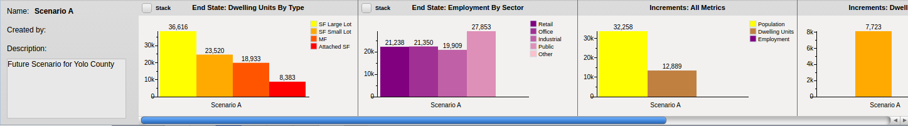

Charts:
* Provide immediate feedback on the Scenario
* By Increment and End State
* Population, Dwelling Unit, and Employment Totals
* Dwelling Units by Type
* Employment by Type

Layer Management
----------------

.. image:: graphics/ScenarioA_LayerOrder.png

* Import Layer
* Layer ordering
* No Symbology Editing
* Export Layers to File Geodatabase

Basic Layer Management
______________________

* Turning layers on and off

 * Click on the check box to the left of the layer name

 * Active layer
 
 * Is always highlighted in blue

Layer Ordering
______________

* Open by clicking on the sideways arrow (highlighted in picture)
* Broken into two categories:

 * Background
 * Foreground

* Drag the layers into the order you want (within the background/foreground groups)

Advanced Layer Management
_________________________

.. image:: graphics/ButtonLocation_AdvancedLayerManagement.png

Then select the Manage Layers option to open the advanced layer management options including adding layers and defining their roles.

Alternatively, you can select "Export Active Layer - to gdb" if you would like to download the active layer for use in ESRI's GIS software.

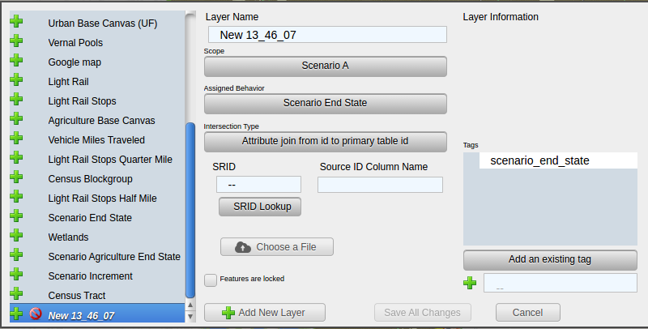

Access the Manage Layers Window by clicking on the down arrow in the layer manager

The same arrow will also give you the option to export the active layer to an ESRI file geodatabase for downloading.

Note:
You can also export layers to an ESRI File Geodatabase for use in ArcGIS. 

Managing Layers
_______________

* Every scenario has a primary layer that provides the spatial structure for the scenario.
* That will frequently be a parcel layer
* This primary or parcel layer is the minimum spatial unit that UrbanFootprint uses.
* Other values are aggregated up from that minimum unit.

Layer Scope, Behavior, and Tags
_______________________________

* Scope: Does this layer apply to just this scenario or to the entire geographic area
* Assigned Behavior: Named roles that the layer can play in UrbanFootprint. At present all roles except “Environmental Constraint” are placeholders for future functionality.
* Tags: Are not fully implemented but will allow for searching for data types within UrbanFootprint

Environmental Constraints
_________________________

* Reduce the developable space in parcels that they have a relationship with. 
* Each layer has a priority and a percentage
* The priority determines which layer takes precedence.
* The percentage determines how much the developable space is reduced.

Polygon Relationships
_____________________

Every layer other than a background layer has a relationship to the primary layer
These relationships can be geographic or attribute table (primary id)
Geographic: (primary to layer)
Polygon to Polygon (many to many)
Centroid to Polygon (one to many)
Polygon to Centroid (many to one)
Attribute Table: One to one

Polygon Relationships Example
+++++++++++++++++++++++++++++
**Basic polygons:** This is the starting point. We have the grid of blue polygons (possibly representing parcels). We'll call this one our primary layer for the example. We also have another polygon (the orange circle) that overlaps a portion of the area. This circle might represent an environmental constraint, but we'll call it the polygon 2 for simplicity.

As used here a "relationship" between a polygon in the primary layer and a polygon in another layer means that the other layer can be used to influence what can be done with the polygon in the primary layer. 

For example, an environmental constraint impacts the developablity of all of the polygons in the primary layer that it has a relationship with.

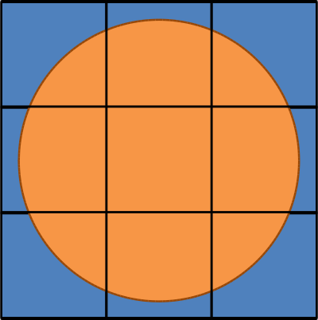

**Polygon to Polygon:**

In a polygon to polygon relationship polygon 2 has a relationship with every polygon in the primary layer that it touches. Represented in the graphic by the salmon color.

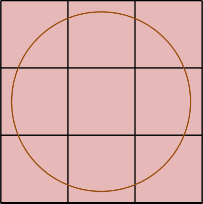

**Centroid to Polygon:**

In a centroid to polygon relationship, the polygon in the primary layer that contains the centroid (polygon 2's geographic center) of polygon 2 has a relationship with polygon 2. The salmon colored polygon in the graphic demonstrates how the center of circle (polygon 2) falls in only the single polygon in the primary layer. 

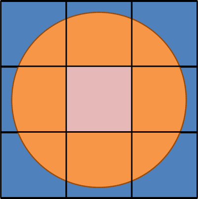

**Polygon to Centroid**

In a polygon to centroid relationship, all of the polygons from the primary layer who's centroids fall inside of polygon 2 have a relationship with polygon 2. Note that in the image below, it captures all but the four corner blue polygons.

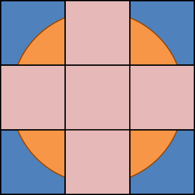

Import Layer
____________

#. Click on “Add New Layer”
#. Choose a zipped shapefile
#. Set Spatial Reference (SRID): (The EPSG code specifies the projection used by the dataset.

 #. SRID Lookup: http://spatialreference.org/ 
 #. California Albers: 3310
 #. Web Mercator (WGS84): 3857

#. Set the Behavior
#. Set Intersection Type
#. Specify the Source ID Column
#. Save Changes

Query Based Selection
_____________________

Query based selection is a slightly more advanced operation that requires basic familiarity with SQL and a little understanding of the database.

The operation selects features in the Active Layer based on a query that you provide.

Query interface:
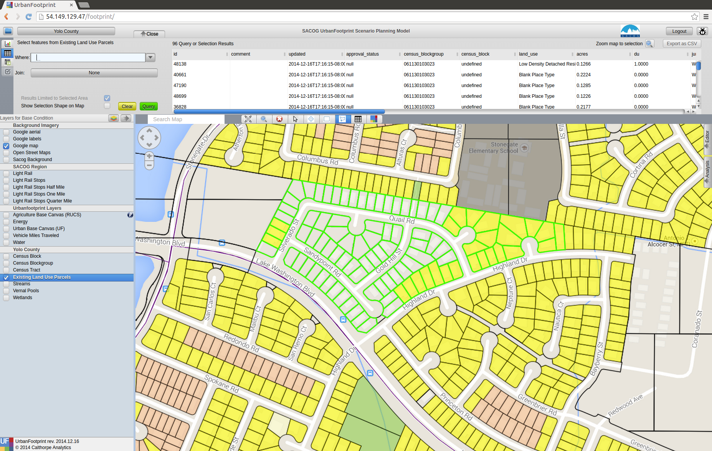

First Example:

Assume that you've selected a set of polygons as in the image above. But, you want to refine your selection to include only the polygons that have 'land_use' = 'Blank Place Type'

This can be done using the query options. 

Open the upper panel by clicking on the "Explore" button, and then select the second tab from the very top on the far left (the table icon) to view the table. At this point you should see something similar to the image above if you've selected some parcels from the Existing Land Use Parcels Layer. 

Then, in the where box enter "existing_land_use_parcels.land_use = 'Blank Place Type'" as shown in the picture below making sure that the "Limit Results to Selected Area" box is checked so that the selection will be made from within your existing selection. *Note:* the arrow right next to the where box will help you look up the names of the available fields and insert them into the box.

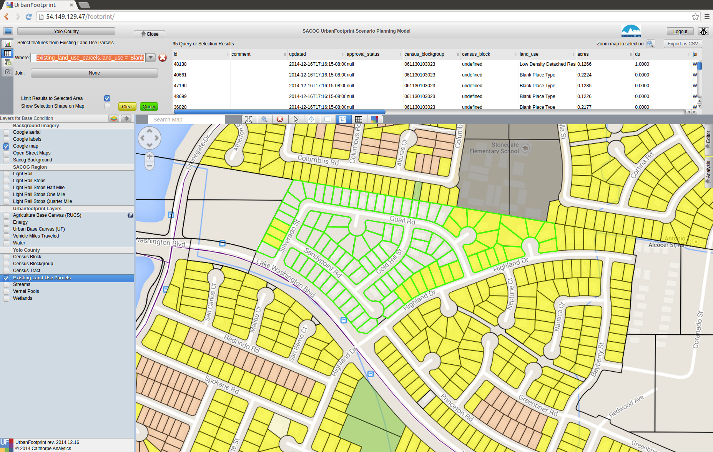

Then, click the green "Query" button. You should get a result that looks like the image below.

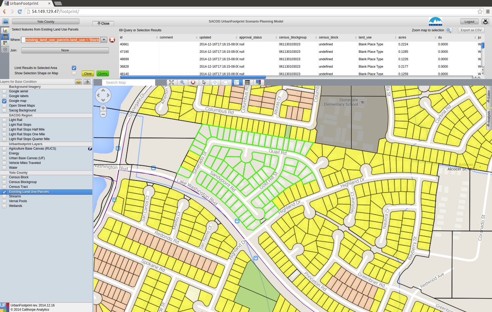

This selection process is the first step of many actions you may take. One of the most common will be selecting parcels in the "End State Canvas" of a scenario and then applying a place or building type to them.

Another alternative is performing an "Aggregate Query" on them to get totals.

To do this click on the button on the far left right below the table button on the top panel to switch to the Feature Summary or Aggregate view. 

Then, you can perform summaries of the selected featurs such as calculating the total population or acres, or average acres or count of feature. This supports the use of "Group By" so that, for example, you can get the total number of housing units by land use type.

Here's an example that continues from our previous point. Enter "SUM(existing_land_use_parcels.acres)" in the "Aggregates" box and leave Group By empty. Like before, the downward pointing arrow will give you a list of available fields and insert them.

 .. image:: graphics/QueryAggregate1.png

That tells us that our selected parcels have a total area of 9.51 acres.

 .. image:: graphics/QueryAggregate2.png

**Detailed Examples**

#. Define an area using the polygon selection tool.
#. Open the query tool, note that it’s copied in the area defined by your box
#. Where: acres_gross > 5

Editing
_______

**Hand Selection (Painting)**
Manual editing by selecting parcels using one of the selection tools.

* Point (image)
* Line (image)
* Polygon (image)

Select the tool

* Box (drag and hold)
* Polygon (click to draw the shape, double click to finish)

Draw the area you want to include in your selection

Any parcel that touches the shape will be selected

**Query Based**

* Select parcels based on a query
* Useful for large area edits or applying changes to a large number of parcels that satisfy a conditon.

Work Flow:

#. Build your query

#. Apply the query

#. Apply the Place Type

Developable Space
_________________

Image here

* How much space in each parcel is actually developable?
* Based on existing construction and environmental constraints.
* Displayed as quantiles. Green will acept the most development, red the least

Scenario Builder
________________

Image here

* Development Pct.
* Density Pct.
* Gross/Net Pct. 
* Clear Base Condition
* Redevelopment Flag
* Apply
* Undo
* Redo
* Revert

Development Percent and Density Percent
+++++++++++++++++++++++++++++++++++++++

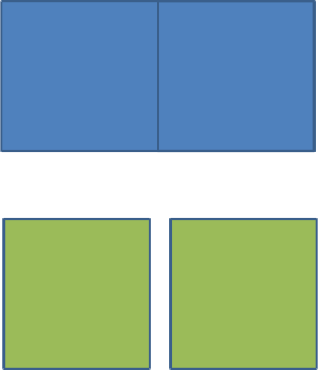

Development Pct.:

  The percentage of the parcel land area to receive the place type.
  50% means that 50% of the available land area will have the place type applied to it. In the graphic half of the parcel has development an the other half does not after applying the place type.

Density Pct.:

  The percentage of the place type densities to apply. 
  80% means that a place type with an average density of 10 du/acre will be applied having 8 du/acre. Note in the graphic the reduced intensity of the right parcel when compared to the left one.

Gross/Net Percentage
++++++++++++++++++++

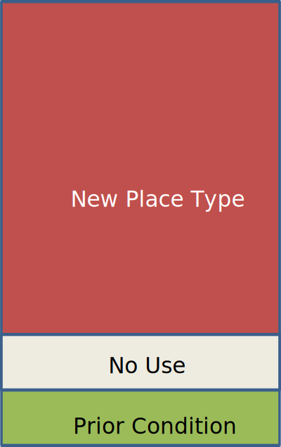

* Allows assignment of a portion of the space to “No Use”
* This is used to reserve space for other uses such as drainage, parks, or other infrastructure. 
* This is applied to the developable percentage.
* For Example: If Dev. Pct is 90% and Gross Net is 90% then 9% of the parcel would be set aside as “No Use.”

 * Assume that we've got a 100 acre parcel
 * Developable space = (100 acres)*90% = 90 acres
 * No Use space percentage = 100%-90% = 10%
 * No Use space = (90 acres) * 10% = 9 acres

Clear Base Condition and Redevelopment Flag
+++++++++++++++++++++++++++++++++++++++++++

Clear Base Condition

  If selected this removes any prior place type from the parcel.
  If this is not selected, new place types are applied only to the developable portion of the parcel’s area
  
Redevelopment Flag

  Manually flag a parcel as having been redeveloped.

Applying Land Use
+++++++++++++++++

Images

Applying a land use involves combining the last few points that were presented.
#. Activate the End State layer
#. Select the Parcels
#. Select the Place Type
#. Adjust Settings

 #. Dev, Density, Gross/net
 #. Clear Base Condition
 #. Redevelopment Flag

#. Apply Place Type

Select Parcels by hand or query

Select the Place Type

* Use the Scenario Builder
* It slides out from the right side of the screen under "Analysis"

Specify Settings for the Place Type

* Development percentage, Density percentage, Gross/Net percentage
* Clear Base Condition

 * Do you want to clear the existing land (redevelopment) or not (infill).

 * Redevelopment Flag to notify users that redevelopment was applied.
 
Analysis
--------

* Some of these tools may take a long time to run.
* They aren’t intended to be run after every change.
* Run at “break points” when you are looking for an update on what the effects of your edits have been on the scenario’s performance

Exercise
--------

**Create your own scenario**

What will your priorities be? How much population will you add? How many new jobs? What kinds of each? And where will you put them?

* Yolo County:

 * Copy Scenario A 
 * Add ~14,000 Population
 * Add ~5,500 Dwelling Units
 * Add ~2,000 Jobs

