Introduction to UrbanFootprint
==============================

Goals
-----

+ To better help you understand what scenario planning is, and why it is being done.
+ to help you better understand what UrbanFootprint is, and what role it can play in scenario planning for your organization or project.

What is a scenario, and what is scenario planning?
--------------------------------------------------

Scenario Planning: a brief history
__________________________________
.. image:: graphics/SPHistory.svg
	:width: 600 px

#. Scenario planning has a long history originating from military practices in the Roman Empire and China
#. More recently, the RAND Corporation made notable use of it in outlining possible US responses to nuclear threats
#. Also, Royal Dutch/Shell’s prior scenario planning exercises led to them diversifying their sourcing and allowed them to better endure the OPEC oil embargo in the 1970s
#. The current and evolving practice is an outgrowth of the types of alternatives analysis used in complying with NEPA and Federal transportation planning requirements. However, until recently most scenario planning consisted of a “build or no-build” suite of policies. 
#. The EnvisionUtah and subsequent projects modeled off of it such as the SACOG Blueprint have expanded on the concept of utilizing a larger variety of scenario options.

Definition of a Scenario
________________________

*An internally consistent view of what the future might turn out to be-not a forecast, but one   possible future outcome.*

(Porter, 1985)

#. Internally Consistent: Each component of the scenario should be coordinated to create a set of scenario ingredients that could reasonably occur together. I.e. land use and transportation components should be coordinated so that areas of focus for transit investment also have appropriate housing and employment.
#. Forecast: a scenario is frequently not a true forecast, which would be a projection based on a continuation of current trends. Instead a scenario planning effort can and should depart from the historic trend in some of the scenarios to explore alternatives to the status quo.

FHWA Definition
+++++++++++++++
The Federal Highway Authority defines Scenario Planning:

  "Scenario planning provides a **framework** for developing a **shared vision** for the future by analyzing various forces (e.g., health, transportation, economic, environmental, land use, etc.) that affect communities. Scenario planning, which can be done at the statewide level or for metropolitan regions, tests various future alternatives that meet state and community needs. A defining characteristic of successful public sector scenario planning is that it actively involves the **public**, the **business community**, and **elected officials** on a broad scale, **educating** them about growth **trends** and **trade-offs**, and **incorporating their values** and feedback into future plans."

Discussion
++++++++++

* Scenario Planning should be considered a framework. There is no single set of practices that will suit every location and every purpose.
* Scenario Planning is a tool for use in developing a shared vision based on an informed discussion of the alternatives, their likely effects, and costs.
* Scenario Planning can be done at any scale, from global to local, though the toolset chosen may vary widely.
* Scenario Planning is an inclusive process with involvement of the public, business community,  trained planners, elected officials, and other interested stakeholders.
* Scenario Planning should be educational. For some people, it will be learning about the likely effects of policy choices. For others, it will teach them what the assembled stakeholders have to contribute to the discussion and what their priorities are.

FHWA Steps for Scenario Planning
++++++++++++++++++++++++++++++++

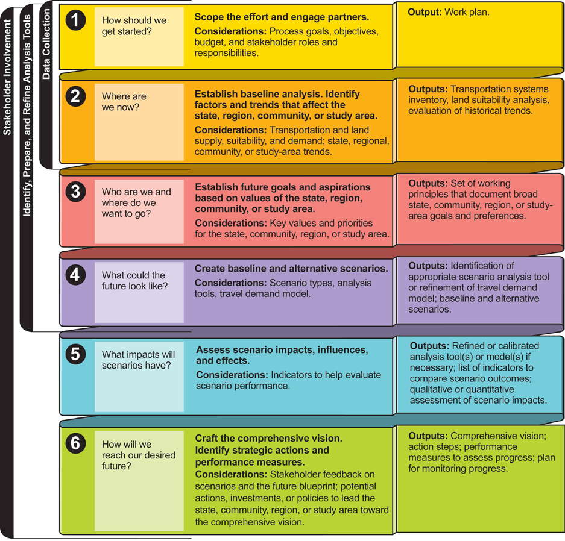

#. Defining the scope of the project
#. Identify current conditions and trends including data assembly
#. Establish goals for the future
#. Develop scenarios
#. Evaluate scenarios
#. Craft a vision including strategic actions and performance measure to guide implementation.

http://www.fhwa.dot.gov/planning/scenario_and_visualization/scenario_planning/scenario_planning_guidebook/guidebook.pdf

Key Elements of Scenario Planning
_________________________________

* Use of scenarios to compare and contrast interactions between multiple factors, such as transportation, land use, and economic development. 
* Analysis of how different land-use, demographic, or other types of scenarios could impact transportation networks. 
* Identification of possible strategies that lead a state, community, region, or study area toward achieving elements of the preferred future. 
* Public engagement throughout the process 

Discussion
++++++++++

#. Comparison of outcomes between multiple scenarios likely with complex interactions between factors.
#. More Specifically, analysis of transportation effects, both transportation system and travel behavior
#. Identifying strategies that lead towards achieving elements of the desired future.
#. Active public and stakeholder involvement.

Why Develop Scenarios?
----------------------

Explore the Range of Possiblities
____________________________________

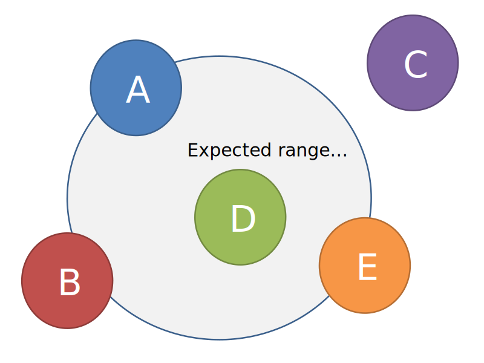

Scenarios are a tool that allow us to explore the range of possibilities for the future. We can propose and compare scenarios that vary widely and across many dimensions. We can push the envelope with our scenarios to look beyond what might be reasonable for implementation, but that might be instructive as we look for implementable solutions.

Analyze Alternatives
____________________________________

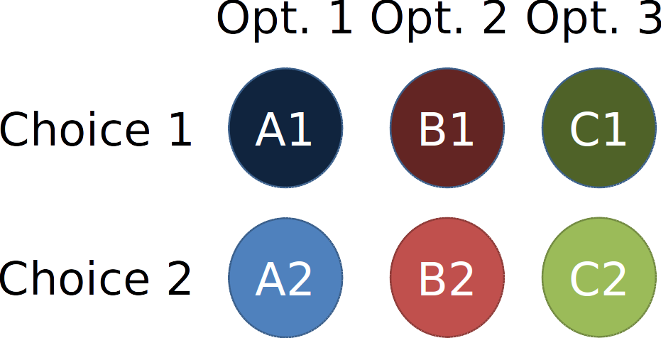

Comparing scenarios using analytical tools lets us compare scenario outcomes based on more than initial responses or gut feelings. Analytical tools applied to a suite of scenarios using appropriate settings allow us to compare scenarios quantitatively. While we do not have the level of certainty in these analytical tools that we have in other purpose built models (such as 4Step or activity based travel demand models), the analytical tools associated with most scenario planning can help us gage the direction and relative magnitude of effects. 

Address Uncertainty
___________________

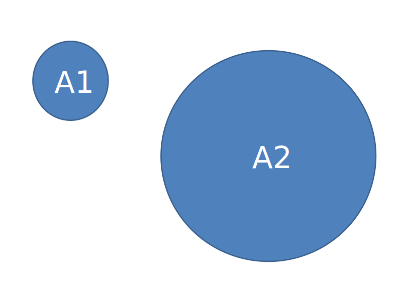

Uncertainty comes in many forms. Building a suite of scenarios can help us choose options that remain viable under a wider variety of factors that we cannot control locally. 

Examples: Population Change (do we have larger or smaller population growth?), Climate Change (Exposure to risk of fire or flood), Economic Growth (changes to the economy, new sectors, rate of growth), Public Sentiment (preference for residential location or format).

Communicate with Stakeholders
_____________________________

Local and Regional Stakeholder Involvement

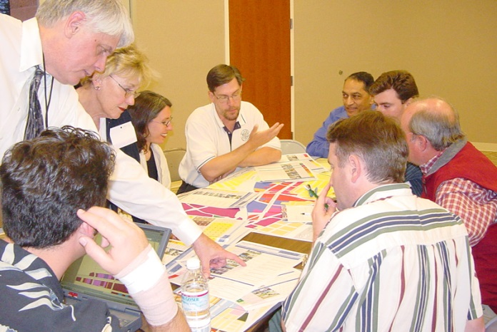

Build Consensus and Partnerships
________________________________

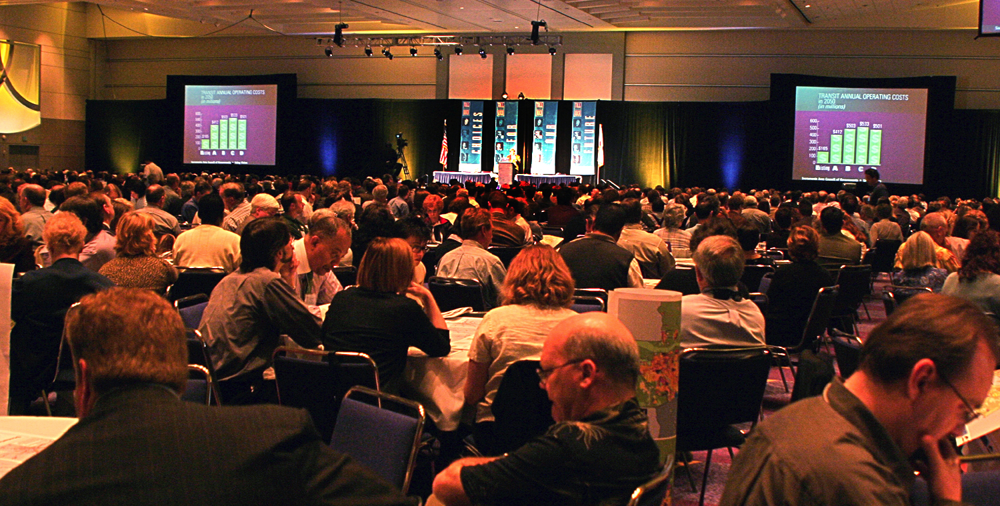

Active (early and frequent) involvement of stakeholders in the discussions throughout the scenario planning activities helps build the partnerships that can create a robust and enduring vision for the future.  Project champions that will support efforts to achieve the goals defined in the scenario are likely to emerge from these partnerships. 

Inform Decision Making
______________________

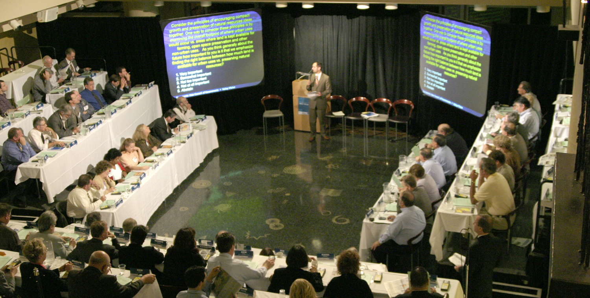

After a scenario planning process the leaders responsible for adopting or implementing strategies to achieve the agreed upon goals need to take action. The improved understanding of the effects that achieving the goals laid out by the scenarios allows decision makers whether elected or appointed make informed choices. Stakeholder support and champions drawn from within the partnerships created during the scenario planning activities help those decision makers defend the choices and resist pressures to underachieve or create unnecessary exemptions.

What Is UrbanFootprint?
-----------------------

.. image:: graphics/UFLogo.png
	:width: 400 px

* A Scenario Planning Platform
* Web Based
* Open Source
* Extendable
* Funded by:

  * State of California (Ca. SGC, Ca. HSRA)
  * MPOs (SACOG, SANDAG, SCAG)
  * NGOs
  * Other State and Federal Grants

Open Source
___________

* GNU Public License v3 

  * http://www.gnu.org/copyleft/gpl.html
  * Anyone who receives the product is entitled to the code
  * Anyone with the code can inspect and modify it
  * Anyone with the code can redistribute it under these same sets of rules.
* The software is “free”

  * Hardware, hosting, support, and staffing not included.

Discussion
++++++++++

* UrbanFootprint is licensed under the GNU Public License v3
* Anyone who is given the product is entitled to the underlying code
* Anyone with the code can modify it for their own use.
* That code can be freely redistributed as long as it has the license is not changed.
* *It’s important to note that in general, open source software is free to obtain, but there are frequently other costs associated with it (hardware, hosting, support, and staff skill development).*

Open Source Software Used by Urban Footprint
____________________________________________

Ubuntu: http://www.ubuntu.com/

* A common Linux distribution

Python: https://www.python.org/

* Programming language

PostgreSQL: http://www.postgresql.org/

* Open Source enterprise database

PostGIS: http://postgis.net/

* Geographic data storage and analysis (an extension to PostgreSQL)

GDAL: http://www.gdal.org/

* Geographic data translation

TileStache: http://tilestache.org/

* Map tile server (provides the graphical content for maps)

Apache: http://httpd.apache.org/

* Web server

Django: https://www.djangoproject.com/

* Web application framework 

Sproutcore: http://sproutcore.com/

* User interface development

Celery: http://www.celeryproject.org/

* Distributed task queue (coordinating multiple simultaneous computing tasks)

Redis: http://redis.io/

* Data structure server (rapid lookup database)

Discussion
++++++++++
UrbanFootprint is built on a suite of open source tools that range from the operating system on the server (linux), the web server(Apache), the programming language (Python), the databases and other programming toolkits (Postgresql/PostGIS, Tilestache, redis, celery, GDAL/OGR, Django), and the user interface (sproutcore).

This means that it can be installed, used, and customized without licensing fees. It can also be shared freely.

A Tour of UrbanFootprint
________________________

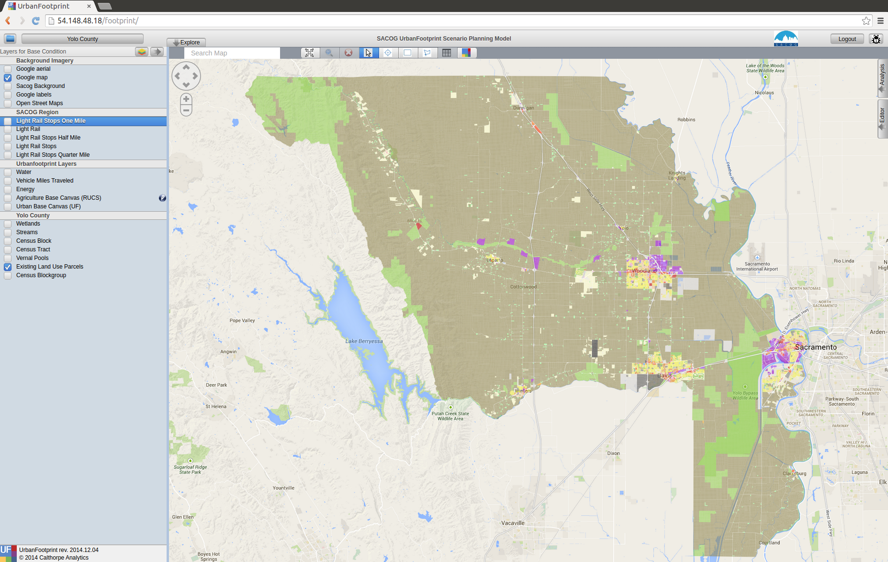

Scenario Management
+++++++++++++++++++

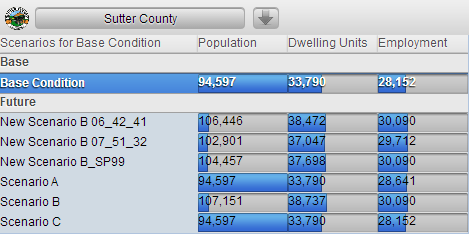

* Switching between scenarios and the base condition
* Quick summary of scenario population, dwelling units, and employment
* Access to the menus for creating and deleting new scenarios

Layer Management
++++++++++++++++

ToDo: Fix this graphic
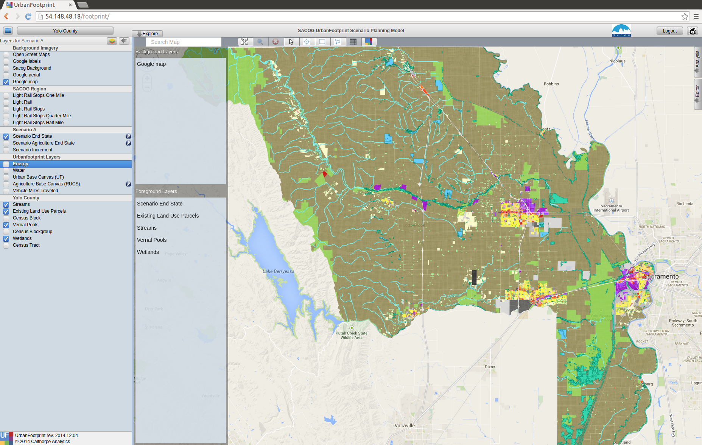

* Turning layers on and off within your display.
* Changing layer display options
* Adding new layers

Charts
++++++

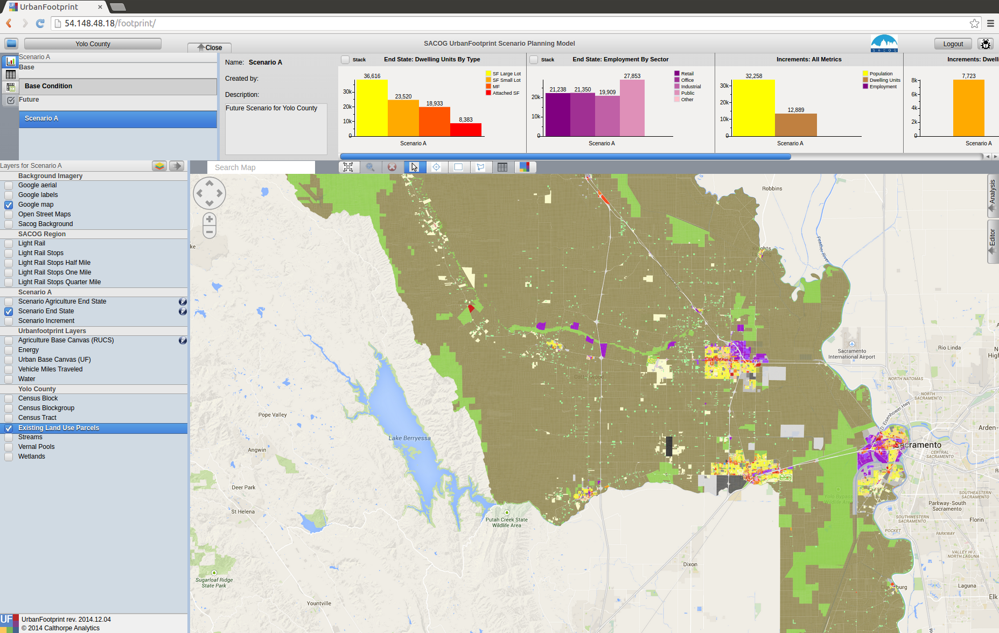

These graphs give you a quick summary of the population, dwelling unit, and employment totals and mixtures for the scenario

The Map
+++++++

Analytical Engines
++++++++++++++++++

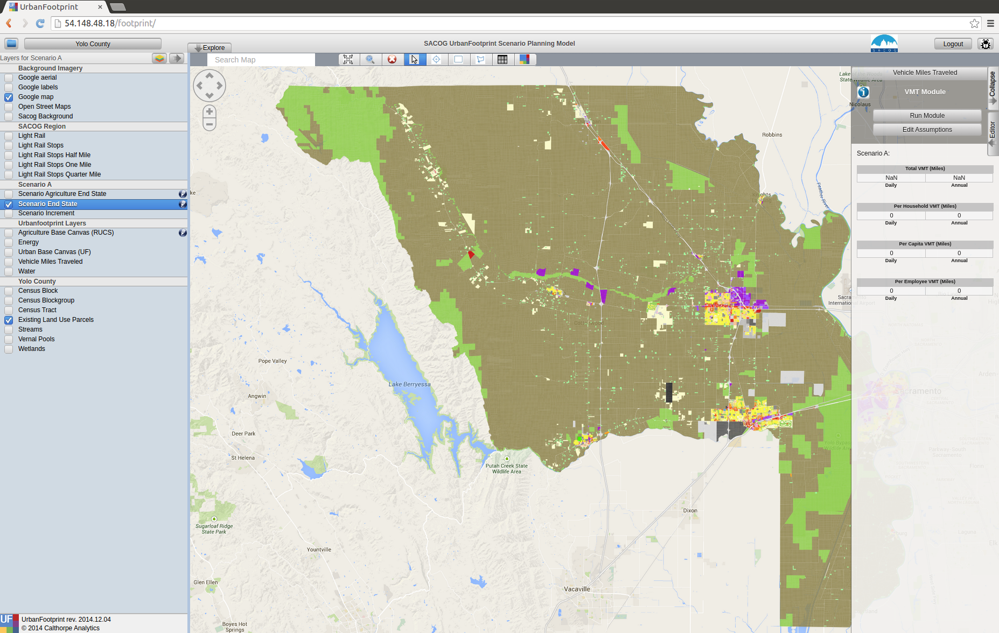

* A wide range of analytical tools that have been built to work with UrbanFootprint.
* Many are linked to each other meaning that outputs from the transportation analysis feed into the public health, criteria pollutant emissions, household costs, and greenhouse gas calculations.
* At present most of these tools have to be run from command line on the server not through the User Interface (UI).
* These analytical engines frequently require calibration to the local environment.

Creating Scenarios
------------------

What the are the Scenario's Goals or Properties?
________________________________________________

* How much population growth?

 * Changes in demographics?

* What kinds of housing will accommodate them?
* How many new jobs? And what kind of job are they?
* Where will housing and job development be prioritized?
* What areas will be protected?

Discussion
++++++++++
#. This is a critical step. Defining the scenarios’ goals and properties sets the rest of the planning process up.
#. Outreach and stakeholder involvement could be highly beneficial depending on your work plan
#. Many features of the scenario should be outlined at this point:

 #. Population change
 #. Employment growth 
 #. Urban Form
 #. Growth centers
 #. Housing types and densities
 #. Land and resource protection goals
 #. Transportation system goals

What are the Current Conditions?
________________________________

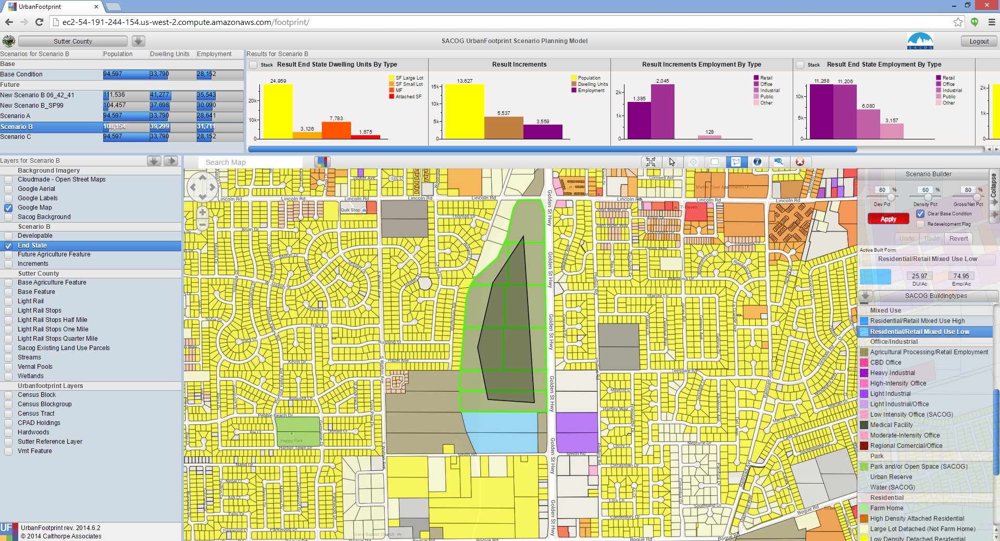

Discussion
++++++++++
#. What are the current conditions? There are no perfect datasets. Each new area being set up for use in UrbanFootprint will need data prepared to describe the current conditions. Generally this will involve a synthesis of data drawn from parcel layers, the US Census, and other local dataset. This dataset will almost certainly require human review and editing prior to use.
#. Some analytical modules require that extra data be prepared to inform and calibrate them.

Translate the Goals onto the Map
________________________________

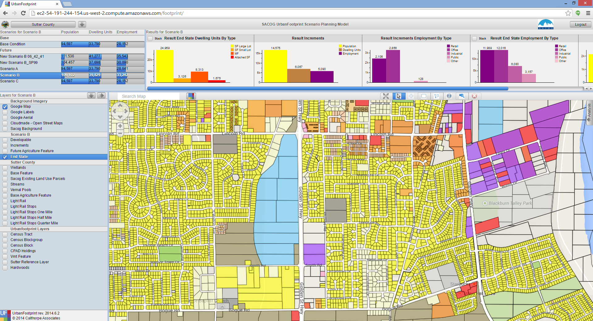

Discussion
++++++++++

#. This is where the map for future land use takes form.
#. Someone has to “paint” the new landscape into place or create it in some other way.
#. This can be time consuming and benefits greatly from an understanding of land use planning and the communities’ identity.
#. Frequently this will involve multiple iterations as a team works to meet targets for population, housing, and employment that were set for the scenario.

Evaluate Scenario Performance
_____________________________

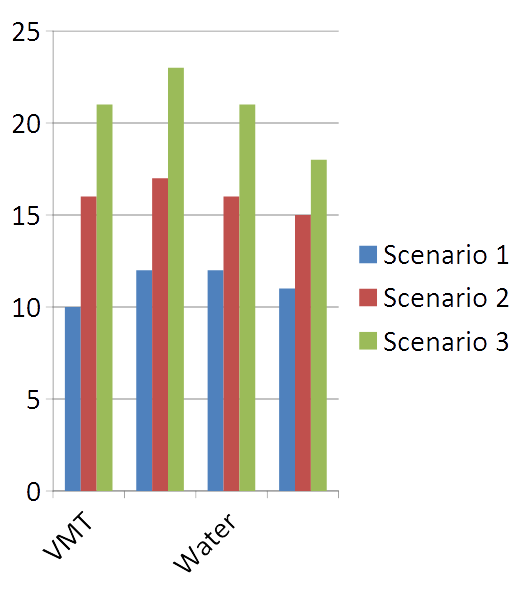

* Compare Scenarios Based on Performance Measures

 * Vehicle Miles Travelled
 * Energy Use
 * Water Use
 * Fiscal Impacts
 * Public Health

* Identify Preferred Outcomes

Discussion
++++++++++

#. Following scenario creation, or iteratively throughout the process before selecting final versions of a scenario, the performance measures can be calculated. 
#. Currently many of these calculations need to be triggered from the command line. 
#. Some of them are relatively fast calculations returning results within seconds, others may take substantially longer depending on the area being calculated and the type of analysis. Transportation in particular can take a while to run.

Transportation Engine
_____________________

.. image:: graphics/TransportSACOG2035.jpg

Graphics can be prepared from the analytical engines that are effective communication tools. This graphic shows the average vehicle miles traveled per household in the Sacramento Area. 

.. image:: graphics/TransportEngine1.png

Note: These are example presentations of the transport engine for the Sacramento area based on the Vision California work done by Calthorpe Associates in 2012.

Discussion
++++++++++
In many cases the raw results won’t be suitable for presentation immediately and will need to be prepared as better looking charts or graphs.

Public Health
_____________________

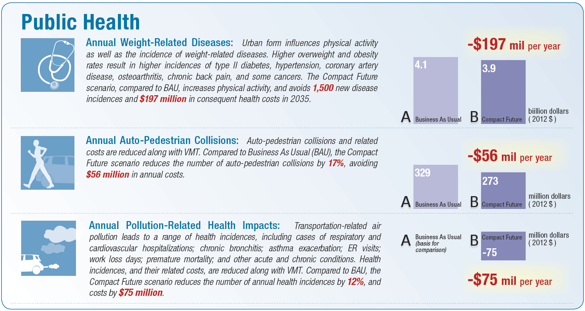

Demonstration graphic.

Discussion
++++++++++
The public health performance measure build on the results of the travel analysis. Results from it can indicate possible changes to public health (diabetes, respiratory, cardiovascular, and auto-pedestrian acciedents) based on the scenario.

The results presented here are demonstration graphics from the 2012 Vision California work conducted by Calthorpe Associates and cover the Sacramento region.

Informing Decisions
-------------------

**People make decisions**
Scenario planning provides information

Discussion
++++++++++

#. Remember that scenario planning does not make decisions, it supports the exploration of scenarios and the identification of the effects (performance measures) that are likely if a scenario were to become reality.
#. The analytical modules provide a standardized way to compare scenarios by performance measure.
#. Based on the suite of performance measures decision makers can select a scenario as preferred vision for the future and develop strategies and plans to achieve it.
